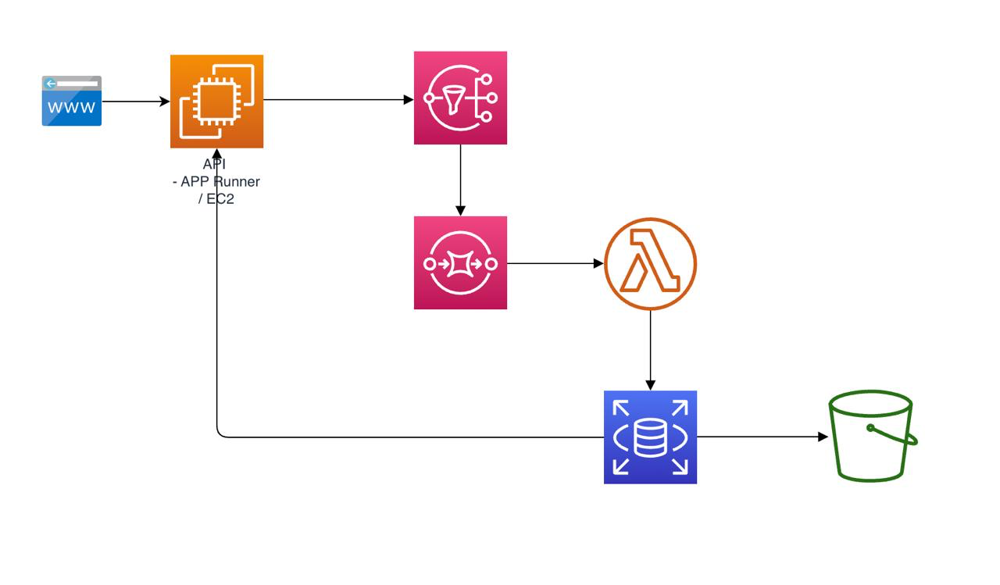
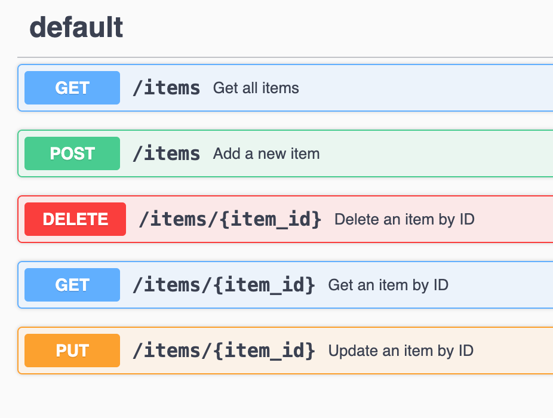

# AWS_Streaming
Ejercicio completo de AWS Streaming con la siguiente arquitectura:



Para conseguir el objetivo de este ejercicio, se deben seguir los siguientes pasos:

# 0. Configurar Terraform

Para poder desplegar la infraestructura necesaria, se debe configurar Terraform con las credenciales de AWS y el Bucket necesario para el estado de Terraform.

```bash
aws s3api create-bucket --bucket XXXXX --region eu-south-2 --create-bucket-configuration LocationConstraint=eu-south-2
```

output:

```bash
{
    "Location": "http://pnieto-terraform-state.s3.amazonaws.com/"
}
```

Una vez creado el bucket, se debe configurar Terraform con la siguiente configuración:

```yaml
terraform {
  backend "s3" {
    bucket = "pnieto-terraform-state"
    key    = "terraform/state"
    region = "eu-central-1"  # Change to your desired AWS region
  }
}
```

Ahora proceded a inicializar Terraform:

```bash
terraform init 
```

Fijaros en el siguiente output:

```bash
Initializing provider plugins...
- Finding latest version of hashicorp/aws...
- Installing hashicorp/aws v5.89.0...
- Installed hashicorp/aws v5.89.0 (signed by HashiCorp)
```

Apliquemos el siguiente comando para aplicar nuestra configuración:

```bash
terraform plan 
```

Fijaros en el siguiente output:

```bash
No changes. Your infrastructure matches the configuration.
```


# 1. Input API

Crear un APP Run en AWS que nos permita desplegar una api de Flask que permita conectar con los mensajes enviados desde el generador

Para completar vuestro primer paso debéis ser capaces de crear los siguientes metodos:



Una vez completado este paso, debéis ser capaces de desplegar la API en AWS y poder acceder a ella a través de la URL que os proporcionará AWS.